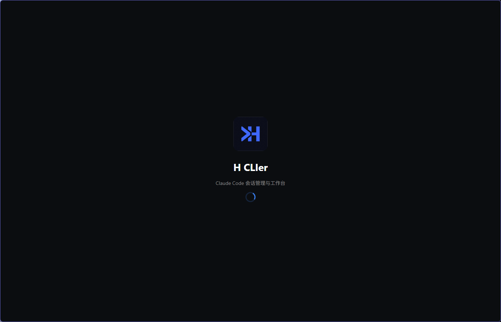
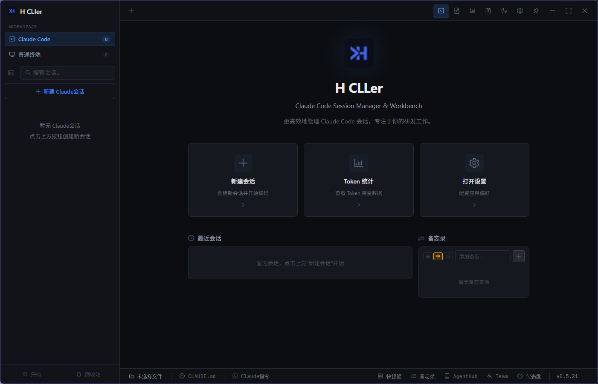
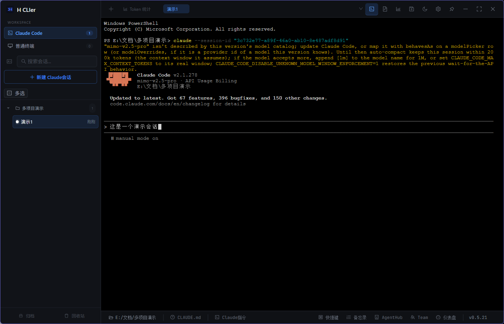
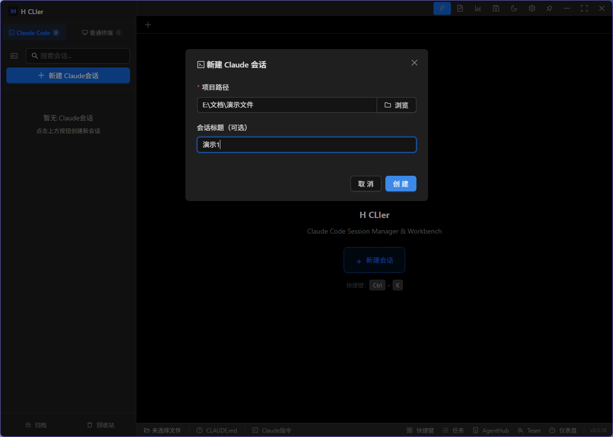
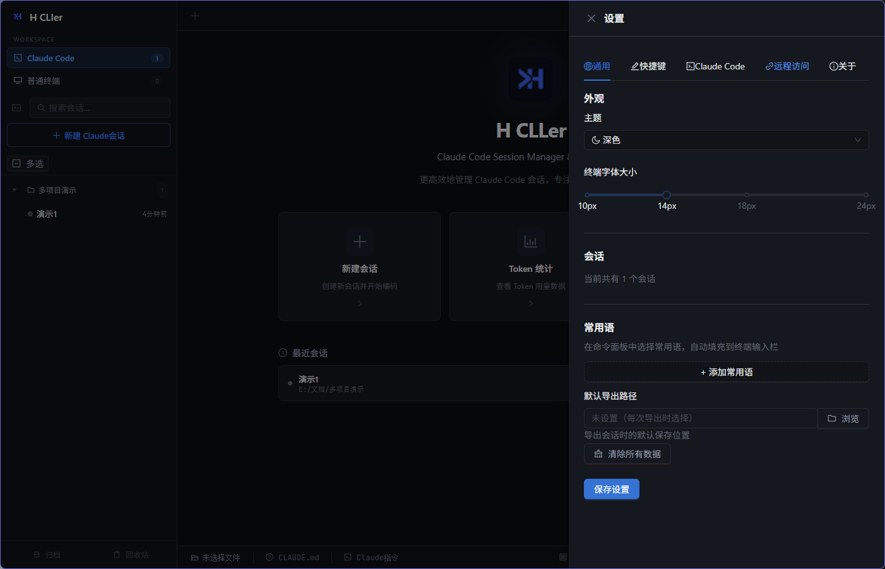
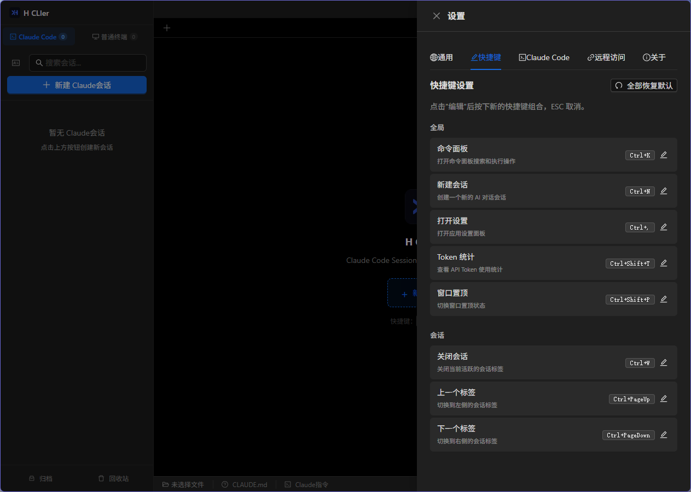
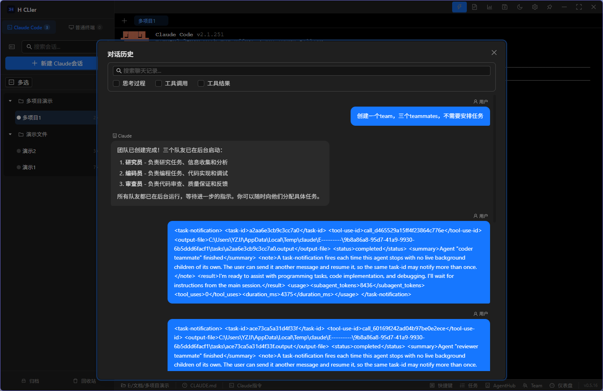
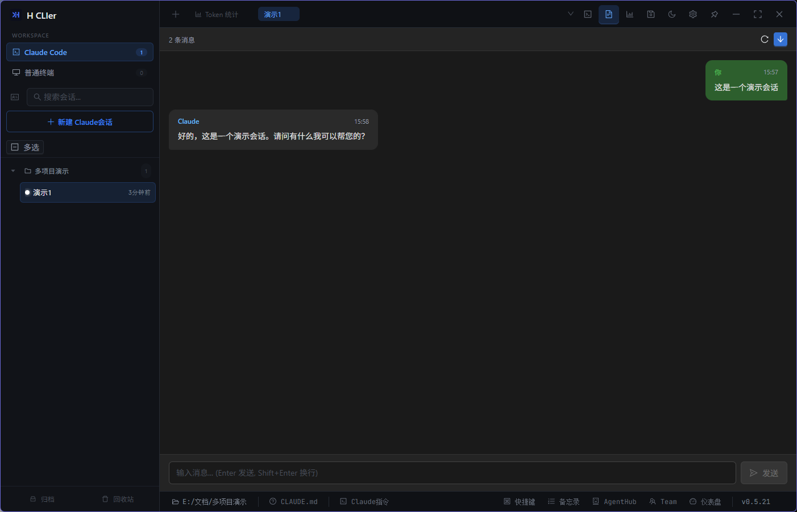

# H CLIer

<div align="center">

**Windows 上 Claude Code CLI 的图形化管理工具**

让 AI 编程助手从终端进入 IDE 级体验

[](LICENSE)
[](https://tauri.app)
[](https://react.dev)
[](https://www.rust-lang.org)
[](https://www.microsoft.com/windows)

[](https://github.com/Fancyhe1/H-CLIer/releases)
[](https://github.com/Fancyhe1/H-CLIer/stargazers)
[](https://github.com/Fancyhe1/H-CLIer/issues)

</div>

---

## 🎯 这是什么？

**H CLIer** 是一款专为 Windows 用户设计的 Claude Code CLI 图形化管理工具。

如果你在 Windows 上使用 Claude Code CLI，是否遇到这些问题：
- ❌ 终端使用不习惯
- ❌ 忘记命令代码
- ❌ 多项目、多会话管理混乱
- ❌ 无法同时多开会话
- ❌ 会话历史容易丢失
- ❌ 缺乏项目快照和回滚功能
- ❌ 多 Agent 协作没有统一管理界面

**H CLIer 就是为了解决这些问题而生的。**

---

## ✨ 核心功能

<div align="center">

  <p>
    
    
  </p>

</div>

### 🪟 Windows 原生支持
- 为 Windows 优化的 PTY 终端，解决 Windows 终端兼容性问题
- 原生 Windows 安装包（NSIS），一键安装
- 支持 Windows 10/11

### 🪟 支持Claude Code设置
- 无损Claude Code CLI
- Claude CLI启动参数设置（支持 `--session-id` / `--resume`等）
- MCP、skills、hooks设置
- 编辑CLADUE.md

### 📁 项目会话管理
- 一键新建会话
- 重启恢复会话（重新打开会话时恢复之前的内容）
- 项目工作区分组 + 拖拽排序
- 收藏标记、颜色标签、软删除回收站
- 会话克隆与 JSON 格式导入导出
- SQLite 持久化存储

### 💻 会话窗口
- 基于 `portable-pty` 的原生 PTY 实例，每会话独立终端
- 可用markdown视图对话
- 支持快捷键、常用语
- 智能剪贴板（`Ctrl+C` 复制选中 / 发送中断信号）
- 未读消息检测 + 任务栏图标闪烁提醒

### 📊 Token 用量追踪
- 增量扫描 Claude 会话 JSONL 文件，按模型（Opus / Sonnet / Haiku）分别计费
- 实时显示日 / 周 / 月 Token 消耗与费用估算
- 7 天趋势图 + 6 个月活跃热力图

### 📸 项目检查点
- 快照整个项目目录（智能跳过 `.git`、`node_modules`、`target` 等）
- 文件级 Diff 对比与一键回滚

### 💬 聊天记录查看
- 解析 Claude 的 JSONL 会话格式
- 识别 `text` / `thinking` / `tool_use` / `tool_result` 四种内容块
- Markdown 渲染 + 可折叠详情面板 + 搜索过滤

### 🤖 AgentHub — Agent 协作中心
- **任务看板**：可视化管理 Agent 任务，支持拖拽和状态追踪
- **Brain 文档**：Agent 共享的项目知识库（架构、规范、决策、状态）
- **工作流**：定义和执行多步骤 Agent 协作流程

### 👥 Team 多 Agent 模式
- Claude Team 多 Agent 并行协作
- 任务分配与进度追踪
- Agent 间消息通信

### 🌐 Web 远程访问
- 基于 axum 的 Web 服务器，提供 REST API
- ngrok 隧道支持，随时随地远程访问
- Web/Mobile 客户端（Capacitor 打包）

### 🔔 通知系统
- Hook 通知：任务完成时推送系统通知（支持 PowerShell / Bash）
- 未读通知：后台会话和非焦点窗口的消息提醒

### 🎨 其他特性
- 亮色 / 暗色 / 跟随系统主题切换
- 内置 CLAUDE.md 编辑器
- GitHub Releases 自动更新检测
- 新手引导（首次使用引导流程）
- 文件浏览器

<div align="center">

  <p>
    
    
  </p>
  <p>
    
    
  </p>
  <p>
    
    
  </p>
</div>

---

## 🚀 快速开始

### 方式一：下载安装包（推荐）

1. 前往 [GitHub Releases](https://github.com/Fancyhe1/H-CLIer/releases) 下载最新版本
2. 运行 `H-CLIer_x.x.x_x64-setup.exe` 安装
3. 启动 H CLIer，开始使用

### 方式二：从源码构建

#### 环境要求

- [Node.js](https://nodejs.org/) >= 18
- [Rust](https://www.rust-lang.org/tools/install) >= 1.77
- [Claude Code CLI](https://docs.anthropic.com/en/docs/claude-code)（`npm install -g @anthropic-ai/claude-code`）
- Windows 10/11 + WebView2

#### 构建步骤

```bash
# 克隆仓库
git clone https://github.com/Fancyhe1/H-CLIer.git
cd H-CLIer/aicoder

# 安装依赖
npm install

# 启动开发模式（前端 + Tauri 后端）
npm run tauri:dev

# 构建生产版本（输出 NSIS 安装包）
npm run tauri:build
```

构建产物位于 `aicoder/src-tauri/target/release/bundle/nsis/`。

---

## 🛠️ 技术栈

| 层级 | 技术 | 用途 |
|------|------|------|
| **前端框架** | React 19 | UI 组件 |
| **类型系统** | TypeScript 6 | 类型安全 |
| **构建工具** | Vite 5 | 开发服务器与打包 |
| **UI 组件库** | Ant Design 6 | 企业级 UI |
| **状态管理** | Zustand 5 | 轻量级状态 |
| **终端仿真** | xterm.js 6 | 终端渲染 |
| **桌面框架** | Tauri 2 | 跨平台桌面应用 |
| **后端语言** | Rust | 系统级性能 |
| **数据库** | SQLite (rusqlite) | 本地持久化 |
| **终端管理** | portable-pty | PTY 终端实例 |
| **Web 服务器** | axum 0.8 | REST API |
| **隧道** | ngrok | 远程访问 |

---

## 📁 项目结构

```
H-CLIer/
├── aicoder/
│   ├── src/                    # 前端源码
│   │   ├── components/         # React 组件
│   │   ├── stores/             # Zustand 状态管理
│   │   ├── types/              # TypeScript 类型定义
│   │   ├── hooks/              # 自定义 Hooks
│   │   └── styles/             # CSS 样式
│   └── src-tauri/              # 后端源码
│       └── src/
│           ├── lib.rs          # Tauri 入口 & 命令注册
│           ├── session.rs      # 会话管理（SQLite）
│           ├── pty.rs          # PTY 终端管理
│           ├── history.rs      # 聊天记录解析
│           ├── token_usage.rs  # Token 用量追踪
│           ├── checkpoint.rs   # 项目检查点
│           ├── agent_hub.rs    # AgentHub 协作管理
│           ├── web_server.rs   # Web 服务器
│           ├── cli.rs          # Claude CLI 检测
│           ├── config.rs       # 配置管理
│           └── license.rs      # 许可证系统
├── .agent-hub/                 # AgentHub Brain 文档
│   └── brain/
├── docs/                       # 文档
│   ├── screenshots/            # 产品截图
│   ├── 安装指南.md
│   ├── 使用教程.md
│   ├── 常见问题.md
│   └── 开发指南.md
├── CHANGELOG.md
├── CONTRIBUTING.md
└── README.md
```

---

## 📖 文档

- [安装指南](docs/安装指南.md) — 详细安装步骤
- [使用教程](docs/使用教程.md) — 功能详解
- [常见问题](docs/常见问题.md) — FAQ
- [开发指南](docs/开发指南.md) — 参与开发
- [更新日志](CHANGELOG.md) — 版本历史

---

## 🤝 贡献

欢迎贡献代码、报告问题或提出建议！

1. Fork 本仓库
2. 创建功能分支（`git checkout -b feature/AmazingFeature`）
3. 提交更改（`git commit -m 'feat: Add some AmazingFeature'`）
4. 推送到分支（`git push origin feature/AmazingFeature`）
5. 创建 Pull Request

详见 [贡献指南](CONTRIBUTING.md)。

---

## 📊 项目状态

| 项目 | 值 |
|------|-----|
| **版本** | 0.5.16 |
| **平台** | Windows 10/11 |
| **许可证** | MIT |

---

## 🔗 相关链接

- [Claude Code CLI](https://docs.anthropic.com/en/docs/claude-code)
- [Tauri 官网](https://tauri.app)
- [问题反馈](https://github.com/Fancyhe1/H-CLIer/issues)

---

## ⭐ Star History

如果觉得有用，请给个 Star 支持一下！

[](https://star-history.com/#Fancyhe1/H-CLIer&Date)

---

<div align="center">

**Made with ❤️ by [Fancyhe1](https://github.com/Fancyhe1)**

</div>
